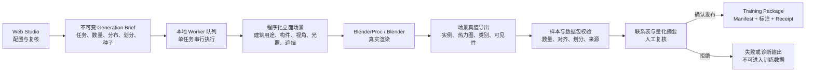

# Blender Facade Synthesis

面向建筑立面分析的 Blender 合成数据生成与发布工具。

本项目使用程序化建筑场景和 BlenderProc/Blender 渲染，生成带有**场景真值（scene truth）**标注的建筑立面数据。目标不是只输出一批效果图，而是交付可直接用于模型训练与评估、能够复现并通过质量检查的任务数据包。

首版聚焦于 **2000 年以来建成或完成实质性改造的中国城市建筑立面**，覆盖住宅、办公、商业和混合用途建筑。

> [!NOTE]
> 首版 Web Studio、串行 BlenderProc Worker 和五类任务数据包已在本仓库实现。生成仍须经过真实 BlenderProc/Blender 渲染、完整校验和人工发布确认，诊断或回退输出不能发布。

## 项目要解决的问题

真实建筑图像的精细标注成本高，窗户实例、楼层分界线、构件分割等标签尤其难以批量、准确地制作。合成数据可以从三维场景直接计算标签，但只有同时满足以下条件，生成结果才真正适合训练：

- RGB 图像必须由真实的 BlenderProc/Blender 渲染流程产生；
- 标签必须来自生成场景，而不是对渲染图再次预测或手工补写；
- 同一建筑的不同视角不能跨越训练集、验证集和测试集；
- 图像、像素级标签、实例信息和元数据必须相互一致；
- 每次生成使用的配置、随机种子、代码版本、渲染器版本和本地视觉资产必须可追溯；
- 只有达到目标样本数、通过校验并经过人工复核的数据包才能发布。

因此，本项目把“生成图片”扩展为一条完整的数据生产线：**配置任务、生成场景、真实渲染、导出真值、严格校验、人工复核、发布数据包**。

## 首版任务数据集

项目不会先生成一个庞大的通用数据集，再从中导出不同任务。每个学习目标都拥有独立的采样策略、标签契约、质量门槛、数据划分和版本号。

| 任务数据集 | 主要训练标签 | 关键约束 |
| --- | --- | --- |
| 窗户实例与计数 | 实例掩码、语义掩码、边界框、稳定实例 ID | 窗户数量由可见实例数推导，不单独生成不可核验的计数标签 |
| 楼层线热力图 | 像素级楼层线热力图 | 场景真值折线保留用于质量检查和评估，但不作为第二套训练目标 |
| 可见楼层数 | 图像级楼层数量 | 统计当前视角下具有足够投影证据的楼层，不等同于建筑总层数 |
| 建筑用途 | `residential`、`office`、`commercial`、`mixed_use` | 混合用途是独立类别，不强行归入住宅或商业 |
| 立面构件分割 | 墙面、窗玻璃、窗框、门、阳台、楼层带、裙房/店面、屋顶/女儿墙、背景 | 只标注当前视角真实可见的像素；完整几何仅保留在元数据中 |

## 技术路线



### 1. 确认生成任务

使用本地 Web Studio 配置一次生成任务，并在开始渲染前确认不可变的 **Generation Brief**。它至少记录：

- 本次数据集对应的学习任务和目标样本数；
- `train` / `validation` / `test` 比例，默认值为 70/15/15，但允许调整；
- 住宅、办公、商业、混合用途的采样分布；
- 正视、轻/中度斜视和强斜视的视角分布；
- 日光条件、实际 Blender 光照参数和曝光参数；
- 无遮挡、轻度遮挡和中度遮挡的分布，目标立面遮挡率控制在 0–30%；
- 随机种子、任务可见性阈值以及可选本地 PBR/HDRI 资产的内容指纹。

首版数据包内的 RGB 和像素级标签保持同一固定分辨率，默认使用 1024×768（4:3）。

### 2. 生成场景并提前划分数据

程序化场景语法负责创建建筑体量、楼层、窗户、阳台、裙房、立面材料及周边遮挡物。建筑配方在渲染前就被分配到训练集、验证集或测试集；同一配方派生出的所有相机和光照视图始终属于同一个划分，避免近重复样本泄漏。

首版场景覆盖：

- 中国城市中较常见的现代住宅、办公、商业和混合用途立面；
- 正视到强斜视的完整立面视角族；
- 晴天、阴天、暖色低角度光和逆光等可复现的日光条件；
- 受控的轻度前景遮挡；
- 内置程序化基础材质，以及可选的本地 PBR 纹理和 HDRI。

### 3. 通过 BlenderProc/Blender 真实渲染

本地 Worker 负责渲染器调用和文件写入，浏览器不直接启动 Blender，也不写数据集文件。Worker 首版一次只运行一个 BlenderProc 任务，以便控制 CPU、GPU 和内存占用，并使日志、进度、取消和恢复都能明确归属于某个任务。

本项目将从已评估的 `img2height` V3.1 合成立面模块中吸收可复用的场景、投影、渲染输出、校验和预览逻辑，但代码会由本仓库独立维护，不使用 Git 子模块、运行时远程依赖或自动上游同步。

启动顺序是一个必须保留的技术约束：Worker 需要先初始化 BlenderProc，再导入 NumPy 和项目生成器模块，以隔离 Blender Python 与主机 Python 环境之间的 ABI 冲突。

### 4. 从场景导出任务原生标签

所有标签都从程序化场景、对象/材质通道或投影几何中产生：

- 窗户实例保留稳定身份，并导出掩码、边界框和计数；
- 可见楼层边界转换为热力图，同时保留像素坐标折线用于 QA；
- 楼层数和建筑用途作为图像级场景真值写入；
- 立面构件从对象与材质通道生成可见像素语义掩码；
- 每个视图单独计算构件、窗户、楼层和边界线的可见性，低于任务阈值的标签不能进入可训练样本。

### 5. 校验、复核与发布

一个渲染进程正常结束，不代表数据包可以使用。每个样本写入后先完成局部校验；整个任务达到目标数量后，再执行完整数据包校验并生成人工复核材料。

以下任一情况都会使数据包保持不可发布状态：

- 未通过 BlenderProc/Blender 完成真实渲染；
- 使用了投影回退或其他替代输出；
- 图像、掩码、热力图或标注尺寸不一致；
- 标签模式、类别词表、可见性或数据划分不合法；
- 本地视觉资产缺失、内容发生变化或指纹不匹配；
- 实际有效样本数未达到 Generation Brief 中的目标数量。

通过自动校验后，还需要查看联系表、类别/视角/光照/遮挡分布及标签质量摘要，并明确确认发布。中断任务可以从已完整写入且通过样本级校验的结果继续；恢复不能绕过最终校验和人工发布确认。

## 训练数据包契约

每个任务数据包都包含一个统一的 JSONL Manifest，以及符合该任务习惯的原生标注：

| 数据内容 | 格式示例 |
| --- | --- |
| 样本索引、数据划分、场景真值与文件引用 | JSONL Package Manifest |
| 窗户实例 | COCO JSON、PNG 语义/实例掩码 |
| 楼层线 | PNG 热力图、JSON 折线 |
| 可见楼层数、建筑用途 | JSONL 图像级标签 |
| 立面构件 | PNG 语义分割掩码 |
| 图像与辅助输出 | RGB 图像，以及任务契约明确要求的渲染通道 |
| 质量检查 | 联系表、校验结果、分布摘要 |
| 发布溯源 | 不可变 Dataset Receipt |

Dataset Receipt 将绑定 Generation Brief 哈希、代码 Git SHA、Blender/BlenderProc 版本、资产指纹、随机种子、实际渲染参数、校验结果和人工发布决定。训练代码位于本项目之外，通过 Manifest 读取发布后的数据包。

## 系统边界

首版明确不包含：

- 在 Web Studio 内训练、评估或部署模型；
- 夜景、雨雪、雾霾和无限制天气退化；
- 分布式渲染农场、并行本地 Worker 或云端数据存储；
- 原生 macOS 应用打包；
- 隐藏区域的 amodal 构件掩码；
- 自动发布数据包；
- 将 `img2height` 保持为子模块或持续同步依赖。

诊断预览可以帮助定位失败原因，但不能作为训练样本发布。

## 实施路线图

当前实施工作按 GitHub Issues 中的依赖关系推进：

1. [SFS-01](https://github.com/LeoAKALiu/blender-facade-synthesis/issues/2)：吸收经过评估的 V3.1 生成器，打通真实 BlenderProc 冒烟渲染；
2. [SFS-02](https://github.com/LeoAKALiu/blender-facade-synthesis/issues/3)：实现 Web Studio、Worker 和首个窗户实例/计数数据包闭环；
3. [SFS-03](https://github.com/LeoAKALiu/blender-facade-synthesis/issues/4)：扩展中国 2000 年后城市立面的视觉课程；
4. [SFS-04](https://github.com/LeoAKALiu/blender-facade-synthesis/issues/5)、[SFS-05](https://github.com/LeoAKALiu/blender-facade-synthesis/issues/6)、[SFS-06](https://github.com/LeoAKALiu/blender-facade-synthesis/issues/7)、[SFS-07](https://github.com/LeoAKALiu/blender-facade-synthesis/issues/8)：依次完成楼层线、可见楼层数、建筑用途和立面构件分割数据包；
5. [SFS-08](https://github.com/LeoAKALiu/blender-facade-synthesis/issues/9)：实现串行队列、安全取消、断点恢复和不可变 Receipt；
6. [SFS-09](https://github.com/LeoAKALiu/blender-facade-synthesis/issues/10)：使用真实 BlenderProc 输出验证所有首版任务的发布契约。

## 参与开发

开始实现前，请先阅读：

- [`CONTEXT.md`](CONTEXT.md)：项目统一术语和领域边界；
- [`docs/specs/2026-07-21-synthetic-facade-training-package-studio.md`](docs/specs/2026-07-21-synthetic-facade-training-package-studio.md)：首版完整规格；
- [`docs/adr/`](docs/adr/)：已经生效的架构决策；
- [`docs/assessments/2026-07-21-img2height-v31-seed-generator-assessment.md`](docs/assessments/2026-07-21-img2height-v31-seed-generator-assessment.md)：V3.1 种子生成器评估结论；
- [GitHub Issues](https://github.com/LeoAKALiu/blender-facade-synthesis/issues)：实施任务、依赖关系和验收标准。

开发时应优先维护外部可观察的数据契约：真实 Blender 渲染、场景真值、配方级数据划分、任务原生标注、失败封闭以及可复现的发布记录。如果实现需要改变已有 ADR，应先补充或替代对应决策，而不是在代码中静默偏离。

## 本地运行

Worker 需要可用的 BlenderProc 和 Blender 运行时；它不会以直接 Blender 或投影输出替代可发布的 Training Package。

```bash
python3 -m pip install -e .
python3 -m facade_synth --workspace .facade-synthesis
```

打开 `http://127.0.0.1:8787`，先执行 BlenderProc 预检，再确认 Generation Brief。完成渲染后，检查联系表与 QA 摘要，并显式确认发布。数据包写入工作区，不写入源代码目录。

## 验证

```bash
PYTHONPATH=src python3 -m unittest discover -s tests -v
ruff check src tests
mypy
```

在具有 BlenderProc 的机器上，还应运行真实发布验收：

```bash
BLENDERPROC_ACCEPTANCE=1 PYTHONPATH=src python3 -m unittest discover -s tests -p 'test_blenderproc_publication_acceptance.py' -v
```

## License

本项目采用 [MIT License](LICENSE)。
